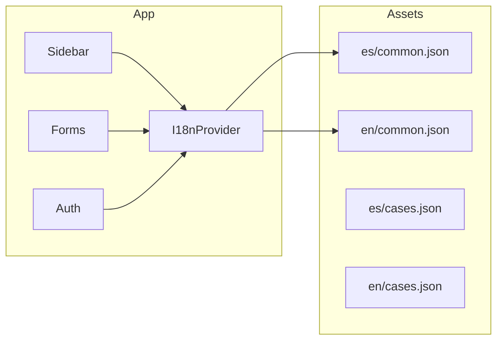

# Plan de internacionalización (i18n) - Español e Inglés

## Situación actual

- **Sin librería i18n**: No hay `react-i18next`, `react-intl` ni similar en [package.json](package.json).
- **Textos en español fijos**: Labels en [Sidebar.tsx](src/shared/components/layout/Sidebar.tsx) (p. ej. "Inicio", "Casos Médicos", "Pacientes"), formularios, modales, toasts y mensajes de validación.
- **Fechas**: [date-fns](https://date-fns.org/) con locale `es` hardcodeado en ~20+ archivos (p. ej. [date-utils.ts](src/shared/utils/date-utils.ts), [ChangelogTable.tsx](src/features/changelog/components/ChangelogTable.tsx), [PatientHistoryModal.tsx](src/features/patients/components/PatientHistoryModal.tsx)).
- **Validación**: Mensajes en español en [form-schema.ts](src/features/form/lib/form-schema.ts) (Zod) y en lógica de auth/registro.
- **Alcance**: ~185 componentes TSX; textos repartidos en `src/features/`, `src/shared/`y`src/app/\`.

## Enfoque recomendado: react-i18next

Para un SaaS grande y mantenible:

- **i18next + react-i18next**: Estándar en ecosistema React, soporta nombrespaces, carga lazy y encaja con Vite.
- **Archivos JSON por idioma y namespace**: Un JSON por `(locale, namespace)` para que traductores o no-dev puedan editar sin tocar código.
- **Claves semánticas**: Uso de IDs (ej. `sidebar.home`, `form.validation.required`) en lugar de texto como clave.
- **Idioma por usuario**: Persistir en `localStorage` y, opcionalmente, en perfil/`user_settings` en Supabase para que la preferencia viaje con la sesión.

## Fases de implementación

### Fase 1: Infraestructura y núcleo

1. **Dependencias**

- Añadir `i18next`, `react-i18next`, `i18next-browser-languagedetector` (detección de idioma del navegador) y, si se quiere type-safety, `i18next-resources-to-backend` para cargar JSON por namespace.

1. **Estructura de carpetas de traducciones**

- Ejemplo: `src/locales/` con `es/` y `en/`, y dentro archivos por namespace: `common.json`, `auth.json`, `sidebar.json`, `cases.json`, `patients.json`, `form.json`, `aseguradoras.json`, `validation.json`, etc. Empezar con `common` y `sidebar` para dejar el patrón claro.

1. **Configuración de i18next**

- Crear `src/i18n.ts` (o `src/app/i18n.ts`): inicializar i18next con `react-i18next`, language detector, fallbackLng `es`, y carga de recursos por namespace (lazy si se usa backend/adapter). Definir lista de namespaces (ej. `['common','sidebar','auth','cases',...]`).

1. **Integración en la app**

- En [main.tsx](src/main.tsx): importar el módulo de configuración i18n antes de renderizar.
- Envolver la app con `I18nextProvider` (o el provider que use tu versión) en [App.tsx](src/App.tsx) para que todos los componentes tengan acceso a `useTranslation`.

1. **Selector de idioma y persistencia**

- Componente pequeño (ej. en header o sidebar): selector ES/EN que llame a `i18n.changeLanguage(lng)` y guarde en `localStorage` (y opcionalmente en Supabase `user_settings` o campo en `profiles`). Leer idioma inicial desde detector o desde BD si el usuario está logueado.

1. **Utilidad de fechas según idioma**

- Centralizar locale de date-fns en función del idioma actual (ej. `i18n.language === 'en' ? en : es`). Crear un hook `useDateLocale()` que devuelva el locale de date-fns y, si hace falta, una función `formatDate(date, formatKey)` que use ese locale. Ir sustituyendo en los archivos que hoy usan `es` hardcodeado por este hook/utilidad para que fechas y meses se muestren en el idioma activo.

### Fase 2: UI compartida y navegación

1. **Namespace `common`**

- Traducir botones genéricos ("Guardar", "Cancelar", "Cerrar", "Buscar", "Filtrar", "Exportar", "Sí", "No", estados como "Cargando...", "Sin resultados"). Usar `useTranslation('common')` en componentes compartidos ([button](src/shared/components/ui/button.tsx), [dialog](src/shared/components/ui/dialog.tsx), modales reutilizables, etc.).

1. **Namespace `sidebar`**

- Extraer todos los `label='...'` del [Sidebar](src/shared/components/layout/Sidebar.tsx) a claves (ej. `sidebar.home`, `sidebar.cases`, `sidebar.patients`, `sidebar.stats`, `sidebar.users`, `sidebar.settings`, `sidebar.logout`, y los nombres de grupos si los hay). Sustituir en el JSX por `t('sidebar.xxx')`. Así toda la navegación queda traducida sin tocar lógica.

1. **Rutas y títulos**

- Si hay títulos de página o breadcrumbs definidos en [route-config](src/app/routes/route-config.tsx) o en layouts, mover esos textos a un namespace (ej. `routes` o `common`) y usar `t()` allí también.

### Fase 3: Módulos por feature

1. **Auth**

- Namespace `auth`: Login, registro, recuperación de contraseña, códigos de laboratorio, mensajes de error/éxito en [LoginForm](src/features/auth/components/LoginForm.tsx), [RegisterForm](src/features/auth/components/RegisterForm.tsx) y páginas relacionadas. Sustituir strings por `t('auth.xxx')`.

1. **Casos y formulario médico**

- Namespaces `cases` y `form`: Labels de formulario, columnas de tablas, filtros, estados (pendiente, aprobado, etc.) en [CasesTable](src/features/cases/components/CasesTable.tsx), [UnifiedCaseModal](src/features/cases/components/UnifiedCaseModal.tsx), [MedicalFormContainer](src/features/form/components/MedicalFormContainer.tsx), [ServiceSection](src/features/form/components/ServiceSection.tsx), etc. Los labels que vienen de **configuración de módulo por laboratorio** (dashboard): decidir si se traducen por clave en front (ej. si el backend envía `procedencia`, mapear a `t('form.fields.origin')`) o se dejan como texto configurado por lab; para consistencia, recomendar mapear claves de campo a claves i18n cuando sea posible.

1. **Pacientes, usuarios, estadísticas, reportes**

- Namespaces `patients`, `users`, `stats`, `reports`: Misma idea: reemplazar textos visibles por claves y usar `t()` en [PatientsPage](src/features/patients/pages/PatientsPage.tsx), [MainUsers](src/features/users/components/MainUsers.tsx), [StatsPage](src/features/stats/pages/StatsPage.tsx), [ExportSection](src/features/reports/components/ExportSection.tsx), etc.

1. **Changelog, triaje, aseguradoras, call center, etc.**

- Aplicar el mismo patrón por feature: un namespace por dominio, extraer strings a JSON, usar `t()` en componentes. En [ChangelogTable](src/features/changelog/components/ChangelogTable.tsx) y [ChangeDetailsModal](src/features/changelog/components/ChangeDetailsModal.tsx) hay además un `translations` local para nombres de campos; unificar con el namespace `changelog` (o `common`) para que todo salga de i18n.

1. **Validación (Zod y mensajes en código)**

- Namespace `validation`: En [form-schema.ts](src/features/form/lib/form-schema.ts), en lugar de strings directos en `.min()`, `.regex()`, etc., usar una función que reciba `t` (inyectada desde el caller o desde un singleton i18n) y devuelva el mensaje, ej. `t('validation.originRequired')`. Misma idea para mensajes en servicios de auth o registro (ej. "Código inválido", "Email ya registrado"). Así todos los mensajes de validación y error quedan traducidos.

1. **Toasts y notificaciones**

- Revisar [sonner](src/shared/components/ui/sonner.tsx) y todos los `toast.success(...)` / `toast.error(...)` del proyecto: mover textos a namespaces (p. ej. `common` o el del feature) y llamar `toast.success(t('cases.saved'))` etc. para que los toasts respeten el idioma.

### Fase 4: Cierre y buenas prácticas

1. **Backend (Express)**

- Si alguna ruta en [backend](backend/server.js) o en [api](api/) devuelve mensajes al usuario (ej. envío de email, errores), considerar enviar códigos de mensaje y que el front resuelva con `t('api.codes.xxx')`, o mantener mensajes en backend y pasar locale en header/cookie para que el backend pueda devolver mensaje en el idioma correcto (menos habitual; suele ser más simple resolver en front).

1. **Contenido dinámico y configuración por laboratorio**

- Opciones como `examTypes`, `branches`, `paymentMethods` que vienen de `laboratories.config`: si son valores mostrados al usuario, se puede definir un mapeo clave → clave i18n (ej. "Citología" → `t('form.examTypes.cytology')`) donde exista; si son libres por lab, dejarlos como están y solo traducir el label del campo ("Tipo de examen", etc.).

1. **Type-safety (opcional)**

- Definir tipos que reflejen las claves de cada namespace (o usar `i18next-parser` para generar claves) y configurar `react-i18next` con tipos estrictos para `t()` para detectar claves faltantes o typos en compilación.

1. **Documentación y onboarding**

- README o doc interna: dónde están los JSON, convención de nombres de claves, cómo añadir un nuevo namespace o idioma. Regla de no añadir strings en español/inglés directos en JSX; siempre usar `t()`.

## Orden sugerido de nombrespaces

| Orden | Namespace    | Alcance principal                        |
| ----- | ------------ | ---------------------------------------- |
| 1     | common       | Botones, estados, términos genéricos     |
| 2     | sidebar      | Navegación lateral                       |
| 3     | auth         | Login, registro, recuperación contraseña |
| 4     | validation   | Mensajes Zod y validaciones en código    |
| 5     | form         | Labels y opciones del formulario médico  |
| 6     | cases        | Tabla de casos, modales, filtros         |
| 7     | patients     | Lista pacientes, historial, responsables |
| 8     | users        | Gestión de usuarios                      |
| 9     | stats        | Estadísticas y gráficos                  |
| 10    | reports      | Reportes y exportación                   |
| 11    | changelog    | Historial de cambios                     |
| 12    | aseguradoras | Módulo Inntegras                         |
| 13    | rest         | Triaje, call center, settings, etc.      |

## Riesgos y consideraciones

- **Rendimiento**: Carga lazy de namespaces evita cargar todos los JSON al inicio; con 2 idiomas y ~15 namespaces el impacto es bajo.
- **Traducciones incompletas**: Definir `fallbackLng: 'es'` y, si una clave falta en inglés, mostrar la clave o el valor en español según política del equipo.
- **Plurales y género**: i18next soporta plurales (`count`) y context; usar si hay frases que lo requieran (ej. "1 caso" / "N casos").
- **No traducir**: Nombres de laboratorio, datos ingresados por usuarios y textos que vienen de la BD (nombres de médicos, sucursales custom) no deben pasarse por `t()`.

## Resumen de tareas técnicas clave

- Instalar y configurar i18next + react-i18next + language detector.
- Crear `src/i18n.ts` y estructura `src/locales/{es,en}/*.json`.
- Provider en App y selector de idioma con persistencia (localStorage + opcional Supabase).
- Hook o utilidad para locale de date-fns según `i18n.language` y sustitución progresiva de `locale: es` por ese valor.
- Sustitución progresiva de strings en: Sidebar → auth → form/cases → validación → resto de features.
- Unificar mensajes de validación (Zod y servicios) con namespace `validation`.
- Opcional: tipos para claves i18n y documentación de convenciones.

Con este plan la app puede estar disponible en inglés y español de forma escalable y mantenible, sin bloquear el resto del desarrollo si se hace por fases (primero infra + common + sidebar, luego feature por feature).
