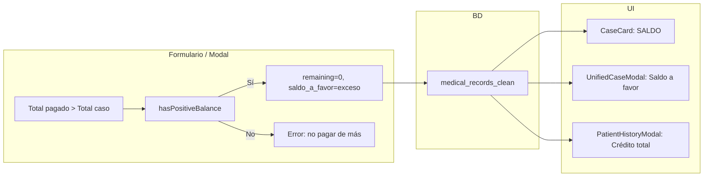
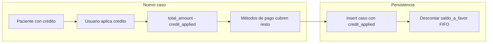

# Plan: Saldo a favor (saldo positivo) por laboratorio

## Resumen de lo que se quiere lograr

- **Problema actual:** Si el paciente paga más del costo del estudio, el sistema no refleja ese exceso; solo marca el caso como "Pagado" y se pierde el dato del sobrante.
- **Objetivo:** Registrar y mostrar ese excedente como "saldo a favor" a nivel de caso y como crédito acumulado en el perfil del paciente, para que pueda usarse en futuros exámenes.
- **Alcance por lab:** Activar la lógica solo cuando el laboratorio tenga la feature habilitada; en tu caso, el lab con slug **lm** (Lab Marihorgen).

---

## Enfoque técnico

- **Persistencia:** Nuevo campo `saldo_a_favor` en `medical_records_clean` (numeric, default 0). Cuando total pagado > total del caso, se guarda el excedente ahí y `remaining` se deja en 0 para que el caso siga como "Pagado".
- **Cálculo de crédito del paciente:** Suma de `saldo_a_favor` de todos los casos del paciente en ese laboratorio (sin tabla nueva).
- **Feature flag:** Añadir `hasPositiveBalance` en `laboratories.features` (jsonb) y activarlo para el lab con slug `lm`. En la app se usará `laboratory?.features?.hasPositiveBalance` o, si prefieres no tocar el dashboard de admin, comprobar solo `laboratory?.slug === 'lm'` en front y en validaciones de formulario.

---

## 1. Base de datos

**Migración nueva (Supabase):**

- En `medical_records_clean` añadir columnas:
  - `saldo_a_favor numeric(10,2) DEFAULT 0` (excedente cuando el paciente paga de más).
  - `credit_applied numeric(10,2) DEFAULT 0` (crédito del paciente aplicado a este caso al crearlo; para auditoría y mostrar en Detalles del Caso).
- Índice opcional para consultas por paciente: no obligatorio al inicio; si luego se filtra mucho por paciente + saldo, se puede añadir.
- El trigger existente `sync_payment_status_with_remaining` no hace falta cambiarlo: cuando hay overpayment guardaremos `remaining = 0` y `saldo_a_favor = excedente`, y el estado seguirirá siendo "Pagado".

**Laboratorio lm:**

- Actualizar el laboratorio con slug `lm` para que en `features` tenga `hasPositiveBalance: true` (por migración o por dashboard/admin según cómo gestiones features).

---

## 2. Lógica de pagos (backend/front)

**Archivos clave:**

- [src/features/form/lib/payment/payment-utils.ts](src/features/form/lib/payment/payment-utils.ts): aquí está `calculatePaymentDetails` (solo devuelve `missingAmount`) y `validateFormPayments` (hoy rechaza si el total pagado > monto del caso).

**Cambios:**

1. **Calcular excedente**

- En `calculatePaymentDetails` (o en una función helper reutilizable) exponer también el **exceso** cuando `totalPaidUSD > totalAmount` (ej. `excessAmount = totalPaidUSD - totalAmount`, redondeado a 2 decimales).
- Tanto el formulario de registro como el modal de edición de caso deben usar este valor para rellenar `saldo_a_favor` cuando la feature esté activa.

1. **Permitir overpayment solo si la feature está activa**

- En `validateFormPayments` (o donde se valide el formulario de pagos), si el lab tiene `hasPositiveBalance` (o `slug === 'lm'`), no tratar como error que `totalPaidUSD > totalAmount`; en ese caso validación OK y se guardará `saldo_a_favor = excessAmount`.
- Para el resto de labs, mantener el comportamiento actual (no permitir pagar de más).

1. **Registro de caso (crear)**

- [src/services/supabase/cases/registration-service.ts](src/services/supabase/cases/registration-service.ts): al calcular `remaining` y `isPaymentComplete`, si la feature está activa y hay excedente, usar `remaining = 0` y pasar `saldo_a_favor = excessAmount` en el objeto que se envía a BD.
- [src/services/supabase/cases/registration-helpers.ts](src/services/supabase/cases/registration-helpers.ts): en `preparePaymentValues` añadir parámetro opcional `saldoAFavor?: number` y devolverlo en el objeto (y mapear a la columna `saldo_a_favor` en el insert). Tipo de insert en el servicio debe incluir `saldo_a_favor`.

1. **Actualización de caso (editar pagos en modal)**

- [src/features/cases/components/UnifiedCaseModal.tsx](src/features/cases/components/UnifiedCaseModal.tsx): al guardar cambios de pagos, recalcular `remaining` y, si la feature está activa y hay excedente, enviar `remaining: 0` y `saldo_a_favor: excessAmount` en el payload de `updateMedicalCase`.
- [updateMedicalCase en medical-cases-service](src/services/supabase/cases/medical-cases-service.ts): aceptar y persistir `saldo_a_favor` en el `update`.

---

## 3. Tipos e interfaces

- En el tipo que mapea a `medical_records_clean` (p. ej. `MedicalCaseWithPatient`, `MedicalCaseInsert`, etc. en [src/services/supabase/cases/medical-cases-service.ts](src/services/supabase/cases/medical-cases-service.ts)) añadir `saldo_a_favor: number | null`.
- En los selects de casos, incluir `saldo_a_favor` para no tener que hacer una query extra.

---

## 4. UI

**Condición de visualización:** Mostrar bloques de "Saldo a favor" / "SALDO" solo cuando el laboratorio tenga la feature (p. ej. `hasPositiveBalance` o `slug === 'lm'`).

1. **Tarjeta de caso (lista de casos)**

- [src/features/cases/components/CaseCard.tsx](src/features/cases/components/CaseCard.tsx): ya usa `laboratory` y tiene lógica por lab (ej. `isMarihorgen` con slug `lm`). Si la feature está activa y `case_.saldo_a_favor > 0`, mostrar junto a "Monto" una línea "SALDO:" con el valor formateado (ej. "+ $X.XX" o "Saldo a favor: $X.XX").

1. **Detalles del caso (sidebar/modal)**

- [src/features/cases/components/UnifiedCaseModal.tsx](src/features/cases/components/UnifiedCaseModal.tsx): en la sección de resumen de pago (donde está "Pago completo" y "Monto faltante"), cuando el caso esté pagado y `saldo_a_favor > 0`, mostrar un bloque tipo "Saldo a favor: $X.XX (USD) / Bs. Y.YY" (usando la tasa del caso). Obtener `saldo_a_favor` de `caseData` o del estado editado.

1. **Perfil del paciente (historial)**

- [src/features/patients/components/PatientHistoryModal.tsx](src/features/patients/components/PatientHistoryModal.tsx): en la zona de información del paciente (arriba), si la feature está activa, añadir una sección "Saldo a favor / Crédito disponible" que muestre la suma de `saldo_a_favor` de todos los casos del paciente (mismo `patient_id`) en el lab actual. Para eso hace falta obtener los casos del paciente (ya existe `getCasesByPatientIdWithInfo` o similar) y sumar `saldo_a_favor`; si la lista ya se carga en el modal, reutilizarla y calcular la suma en front; si no, exponer un pequeño endpoint o RPC que devuelva solo el total (opcional).

---

## 5. Feature flag por laboratorio

- **Opción A (recomendada):** Añadir en el tipo `LaboratoryFeatures` (en [src/shared/types/types.ts](src/shared/types/types.ts)) la propiedad `hasPositiveBalance?: boolean`. En el dashboard/admin (o en la migración que actualiza `lm`) setear `features.hasPositiveBalance = true` para el lab `lm`. En la app, comprobar `laboratory?.features?.hasPositiveBalance`.
- **Opción B:** No tocar el schema de features y usar solo `laboratory?.slug === 'lm'` en los puntos anteriores. Más rápido pero menos flexible si otro lab pide la misma función después.

---

## 6. Flujo de datos (resumen)

---

## 7. Aplicar crédito al crear nuevo caso (obligatorio)

Objetivo: al registrar un nuevo caso, si el paciente tiene crédito acumulado (suma de `saldo_a_favor` de sus casos), el usuario puede aplicar parte o todo ese crédito para reducir el monto a pagar. El pago se considera completo cuando `totalPaidUSD + creditApplied >= total_amount`.

### 7.1 Modelo de datos

- **Columna en `medical_records_clean`:** `credit_applied numeric(10,2) DEFAULT 0`. Indica cuánto crédito del paciente se aplicó a este caso (solo tiene sentido al crear el caso; para casos ya existentes será 0 salvo que se implemente edición futura).
- **Descuento del crédito:** Al guardar un caso con `credit_applied > 0`, hay que **reducir** el crédito disponible del paciente descontando de casos anteriores. Regla: FIFO por fecha del caso (o por `created_at`). Recorrer los casos del mismo `patient_id` y mismo `laboratory_id` con `saldo_a_favor > 0`, ordenados de más antiguo a más reciente, e ir restando de `saldo_a_favor` hasta haber descontado exactamente `credit_applied`. Implementación recomendada: función en el backend (RPC o dentro del flujo de creación) que reciba `patient_id`, `laboratory_id`, `amount_to_deduct` y actualice las filas correspondientes en una transacción.

### 7.2 Lógica de pago con crédito aplicado

- **Monto a cubrir con métodos de pago:** `total_amount - credit_applied` (en USD). Si `credit_applied >= total_amount`, el caso puede quedar pagado solo con crédito (remaining = 0, payment_status = 'Pagado') sin necesidad de métodos de pago, o con métodos en 0.
- En [payment-utils](src/features/form/lib/payment/payment-utils.ts): considerar `creditApplied` en el cálculo de “pago completo”: `isPaymentComplete = (totalPaidUSD + creditApplied) >= totalAmount`, y `missingAmount = totalAmount - totalPaidUSD - creditApplied` (no menor que 0).
- En [registration-service](src/services/supabase/cases/registration-service.ts): al preparar el caso, recibir `creditApplied` del formulario; guardar `credit_applied`, `remaining = max(0, totalAmount - creditApplied - totalPaidUSD)`; después del insert, llamar a la lógica que descuenta el crédito FIFO (misma transacción o paso siguiente).

### 7.3 Formulario de registro (nuevo caso)

- **Obtener crédito del paciente:** Cuando el formulario tenga `patient_id` (paciente seleccionado en el flujo de nuevo caso), consultar la suma de `saldo_a_favor` de todos los casos de ese paciente en el lab actual. Puede ser un hook o query que llame a un endpoint/RPC que devuelva el total, o calcular en front si ya se cargan los casos del paciente.
- **Campo en el formulario:** Añadir un campo (por ejemplo en [PaymentSection](src/features/form/components/PaymentSection.tsx) o en la sección de pagos del [MedicalFormContainer](src/features/form/components/MedicalFormContainer.tsx)) solo visible cuando `hasPositiveBalance` y crédito disponible > 0: “Aplicar saldo a favor” con input numérico (máximo = `min(crédito disponible, totalAmount)`). Valor por defecto 0. Guardar en el estado del formulario (ej. `creditApplied`) y enviarlo al submit.
- **Cálculo de “Monto faltante” / “Pago completo”:** En la UI de pagos, el monto a cubrir con métodos de pago es `totalAmount - creditApplied`. Mostrar algo como “Crédito aplicado: $X.XX” y “Monto restante a pagar con métodos: $Y.YY” para que quede claro.

### 7.4 Persistencia y tipos

- [registration-helpers](src/services/supabase/cases/registration-helpers.ts): `preparePaymentValues` (o el objeto que arma el caso) debe incluir `credit_applied` cuando la feature esté activa.
- [medical-cases-service](src/services/supabase/cases/medical-cases-service.ts): tipos `MedicalCaseInsert`, `MedicalCaseWithPatient` y selects deben incluir `credit_applied`.
- **UnifiedCaseModal (Detalles del Caso):** Si el caso tiene `credit_applied > 0`, mostrar en la sección de pago algo como “Crédito aplicado a este caso: $X.XX (USD) / Bs. Y.YY”.

### 7.5 Flujo resumido

---

## Orden sugerido de implementación

1. Migración: columnas `saldo_a_favor` y `credit_applied`, y actualización de `features` para `lm`.
2. Tipos e interfaces: `MedicalCaseWithPatient`, `MedicalCaseInsert`, etc., y `preparePaymentValues` (incluir ambos campos).
3. payment-utils: devolver excedente, relajar validación cuando `hasPositiveBalance`; añadir soporte para `creditApplied` en el cálculo de pago completo y monto faltante.
4. registration-service + registration-helpers: calcular y guardar `saldo_a_favor` al crear caso; aceptar y guardar `credit_applied`; implementar (o llamar a) la lógica FIFO que descuenta `saldo_a_favor` de casos anteriores del paciente.
5. medical-cases-service: incluir `saldo_a_favor` y `credit_applied` en selects y en `updateMedicalCase`.
6. UnifiedCaseModal: al guardar edición de pagos, enviar `saldo_a_favor`; en la vista, mostrar "Saldo a favor" cuando sea > 0 y "Crédito aplicado" cuando `credit_applied > 0`.
7. CaseCard: mostrar "SALDO" cuando feature activa y `saldo_a_favor > 0`.
8. PatientHistoryModal: sección "Crédito disponible" con suma de `saldo_a_favor` de los casos del paciente.
9. Formulario de nuevo caso: obtener crédito del paciente; campo "Aplicar saldo a favor" y envío de `creditApplied`; considerar crédito en validación de pago completo.
10. Pruebas manuales: lab `lm` con overpayment, con aplicación de crédito en nuevo caso y verificación de descuento FIFO; otro lab sin feature no debe aceptar overpayment ni mostrar saldo ni aplicar crédito.

Con esto se cumple el objetivo completo: saldo a favor guardado y visible, y uso de ese crédito al crear un nuevo caso para reducir el monto a pagar, activo solo para el lab que tenga la feature (lm).
