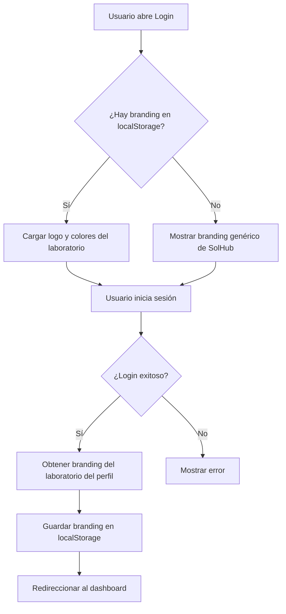

# 🎨 Sistema de Branding Dinámico en Login

## 📋 Descripción General

Este sistema permite que la pantalla de login muestre automáticamente el logo y colores del último laboratorio que inició sesión en ese dispositivo, mejorando la experiencia del usuario y reduciendo confusiones en ambientes donde múltiples laboratorios usan la misma aplicación.

## 🎯 Características

- ✅ **Persistencia local**: El branding se guarda en `localStorage` después de cada login exitoso
- ✅ **Carga sin parpadeo**: El branding se aplica antes de que el usuario vea la pantalla
- ✅ **Fallback genérico**: Si no hay branding guardado, se muestra el logo y colores de SolHub
- ✅ **Cambio de laboratorio**: Botón para limpiar el branding en computadoras compartidas
- ✅ **Colores dinámicos**: Aurora background y botones se adaptan al color primario del laboratorio

## 🔧 Implementación Técnica

### Archivos Modificados/Creados

1. **`src/shared/hooks/useDynamicBranding.ts`** (NUEVO)
   - Hook personalizado para manejar el branding
   - Funciones: `saveBranding`, `clearBranding`, `hasBranding`

2. **`src/features/auth/components/LoginForm.tsx`** (MODIFICADO)
   - Integra el hook `useDynamicBranding`
   - Muestra logo y colores dinámicos
   - Guarda branding después de login exitoso

### Flujo de Funcionamiento



### Estructura de Datos

```typescript
interface BrandingConfig {
  logo: string;              // URL del logo del laboratorio
  primaryColor: string;      // Color primario (#RRGGBB)
  laboratoryName: string;    // Nombre del laboratorio
  icon?: string;             // Icono opcional
}
```

**Almacenamiento en localStorage:**
```javascript
{
  "last_lab_branding": {
    "logo": "https://..../logo.png",
    "primaryColor": "#3d84f5",
    "laboratoryName": "Laboratorio ABC",
    "icon": "LAB"
  }
}
```

## 🎨 Personalización Visual

### Logo
- Si existe branding: Muestra el logo del laboratorio
- Si falla la carga: Fallback al logo genérico de SolHub
- Altura fija: 64px (clase `h-16`)

### Colores
- **Aurora Background**: Se adapta al `primaryColor` del laboratorio
- **Botón de Login**: Border color dinámico basado en `primaryColor`
- **Título**: Cambia a "Bienvenido a [Nombre del Laboratorio]"

### Botón "Cambiar lab"
- Solo visible cuando hay branding guardado
- Posición: esquina superior derecha del logo
- Acción: Limpia el `localStorage` y recarga el branding genérico

## 🔒 Seguridad y Privacidad

- **Computadoras compartidas**: El botón "Cambiar lab" permite limpiar el branding
- **Sin datos sensibles**: Solo se guarda información de branding (logo, colores, nombre)
- **Aislamiento por dispositivo**: Cada navegador/dispositivo mantiene su propio branding

## 📱 Casos de Uso

### Caso 1: Primer acceso (Sin branding guardado)
```
1. Usuario abre login
2. Ve logo genérico de SolHub con colores azules por defecto
3. Inicia sesión con credenciales de "Laboratorio ABC"
4. Sistema guarda branding de "Laboratorio ABC"
5. Próximo acceso mostrará logo de "Laboratorio ABC"
```

### Caso 2: Acceso recurrente (Con branding guardado)
```
1. Usuario abre login
2. Ve inmediatamente logo y colores de "Laboratorio ABC"
3. Inicia sesión
4. Continúa al dashboard
```

### Caso 3: Computadora compartida
```
1. Usuario A de "Laboratorio ABC" ya inició sesión previamente
2. Usuario B de "Laboratorio XYZ" abre login
3. Ve logo de "Laboratorio ABC" (del usuario anterior)
4. Usuario B hace clic en "Cambiar lab"
5. Branding se limpia, ve logo genérico
6. Inicia sesión con sus credenciales de "Laboratorio XYZ"
7. Sistema guarda branding de "Laboratorio XYZ"
```

## 🧪 Testing

### Test Manual 1: Primer Login
1. Abrir navegador en modo incógnito
2. Ir a `/login`
3. Verificar que se muestra logo genérico de SolHub
4. Iniciar sesión con usuario de un laboratorio
5. Cerrar sesión
6. Verificar que al volver a `/login` se muestra el logo del laboratorio

### Test Manual 2: Cambio de Laboratorio
1. Con branding guardado, abrir `/login`
2. Verificar que se muestra el botón "Cambiar lab" en esquina superior derecha
3. Hacer clic en "Cambiar lab"
4. Verificar que se muestra logo genérico de SolHub
5. Verificar que desaparece el botón "Cambiar lab"

### Test Manual 3: Error en Carga de Logo
1. Editar localStorage manualmente con URL de imagen inválida
2. Abrir `/login`
3. Verificar que hace fallback al logo genérico sin errores en consola

### Verificación en Consola del Navegador
```javascript
// Ver branding guardado
localStorage.getItem('last_lab_branding')

// Limpiar branding manualmente
localStorage.removeItem('last_lab_branding')

// Guardar branding de prueba
localStorage.setItem('last_lab_branding', JSON.stringify({
  logo: "https://ejemplo.com/logo.png",
  primaryColor: "#ff0000",
  laboratoryName: "Lab Prueba"
}))
```

## 🐛 Debugging

### Logs en Consola
El sistema genera logs útiles para debugging:

```javascript
// Al cargar branding desde localStorage
console.log('Error cargando branding desde localStorage:', error)

// Al guardar branding después de login
console.log('✅ Branding guardado:', lab.name)

// Al limpiar branding
console.log('Error limpiando branding:', error)

// Si falla carga de logo
console.error('Error cargando logo del laboratorio:', branding.logo)
```

### Problemas Comunes

**Problema: Logo no se muestra**
- Verificar URL del logo en `laboratories.branding.logo`
- Verificar CORS del servidor de imágenes
- Revisar Network tab para ver si la solicitud falla

**Problema: Colores no cambian**
- Verificar formato del color (`#RRGGBB`)
- Verificar que `laboratories.branding.primaryColor` existe

**Problema: Branding no persiste**
- Verificar que el navegador permite `localStorage`
- Verificar que no hay extensiones bloqueando storage
- Verificar que el dominio es el mismo (no http vs https)

## 🚀 Mejoras Futuras

- [ ] Soporte para múltiples temas (claro/oscuro)
- [ ] Animación de transición al cambiar branding
- [ ] Cache de imágenes para carga más rápida
- [ ] Soporte para gradientes personalizados en Aurora
- [ ] Branding por subdominio (ej: lab1.solhub.com)
- [ ] Previsualización de branding en configuración de laboratorio
- [ ] Métricas de uso de branding por laboratorio

## 📚 Referencias

- **Hook principal**: `src/shared/hooks/useDynamicBranding.ts`
- **Componente**: `src/features/auth/components/LoginForm.tsx`
- **Tabla Supabase**: `laboratories.branding` (JSONB)
- **LocalStorage Key**: `last_lab_branding`

---

**Última actualización**: Febrero 2026  
**Autor**: Equipo Solware  
**Versión**: 1.0.0
